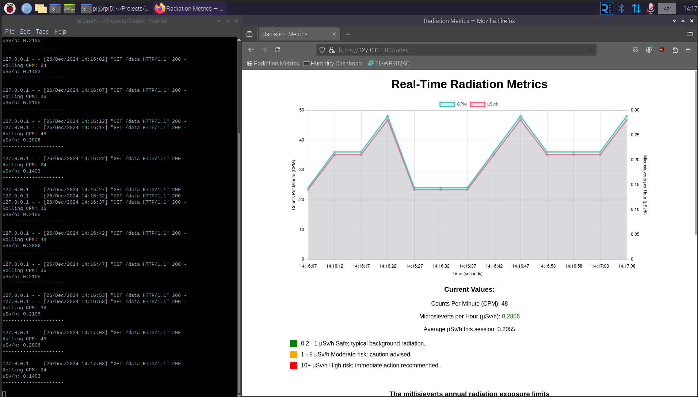
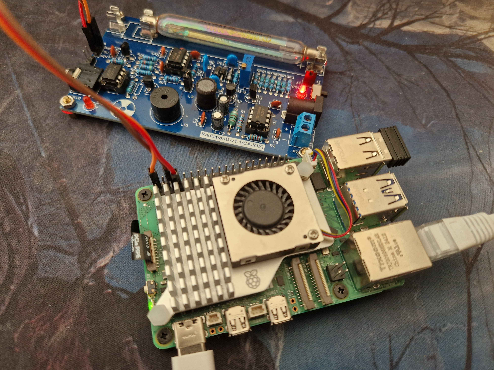

## What will you need

* Geiger–Müller kit [for example this one](https://www.ebay.com/itm/396034408437?_skw=Geiger_Counter_RadiationD-v1.1-CAJOE)
* Raspberry pi - any model is fine but guide is written for raspberry pi 5. For older models you will need to make some adjustments

## Hardware

Connect 5V to any 5V, Ground to any ground and VIN to GPIO4 (pin 7)

### Rpi5 GPIO diagram


### μSv/h Ratio

Check the tube that is installed in your kit. In my case, I have J305. We need to calculate μSv/h ratio based on the tube's sensitivity.
For J305, almost everyone is using the wrong coefficient/ratio of 0.00812037037037. Here is the formula I used, together with a source elaborating why 0.0081 is wrong: J305 has 25 CPM

`1 / (25 * 60 / 8.77) = 0.00584666666667`

[Source](https://medium.com/@iotdevices/geiger-tube-j305-how-to-calculate-the-conversion-factor-of-cpm-to-%CE%BCsv-h-technical-note-b0cc14850576)

## Software

I am using Raspbian OS. If you have a different OS, commands may differ.

### Required files
Navigate to <b>[this](https://github.com/saipheblue/Rpi5_Geiger_Counter_RadiationD-v1.1-CAJOE?search=1)</b> repository and clone it.

In documentation folder, you can find more detailed information about how everything works and values used in calculations

## Issues & pre-req

### Install flask

```
pip install flask
```
If you got permisisons error, use sudo

If you get a 404 error, make sure index page is in the "templates" folder. It is case sensitive. The structure should be as follows:

    Project
        geiger.py
        templates
            index.html

### M4011 tube

The manufacturer’s documentation lists the M4011, which has the same specs as the J305.

### SSL

`ssl_context=('cert.pem', 'key.pem')` can be replaced by `ssl_context='adhoc'` if you dont have the keys

[Source](https://zhangtemplar.github.io/flask/)

### GPIO problem

RPi 5 has issues with GPIO. Remove the current GPIO library using:
```
sudo apt remove python3-rpi.gpio
```
Then install lgpio:
```
python3 -m pip install rpi-lgpio flask
```
If you have installation problems, use this (but it could break system packages, or you can use a virtual environment):
```
python3 -m pip install rpi-lgpio flask --break-system-packages
```
[more info](https://pimylifeup.com/python-externally-managed-environment/)

## Run the script

Simply run <b>geiger.py</b> to start measuring:

```
python3 geiger.py
```

Then navigate to <b>`127.0.0.1:80/index`</b> to see the chart
