> Disclaimer:
> This post was created with the help of an LLM ( also incorrectly referred to as AI ), mostly for grammar correction. Most of the generated "translation" is based on my own text, wiki entries, or official game descriptions.

-------------------

There’s something both haunting and captivating about wandering through abandoned video game worlds. The concrete jungles, where rusted steel beams entwine crumbling concrete panels like skeletal vines, feel like places you’ve visited in fleeting dreams or glimpsed at the edges of your memory, though you know you never truly have. They exert a peculiar pull, a delicate tension between familiarity and unease.

I think I’ve finally pinpointed why these spaces fascinate me so deeply. It’s the uncanny valley—not in the usual sense of lifelike robots or hyperrealistic characters, but in how these places mimic the real world while feeling subtly... wrong. This ties closely to the concept of liminal spaces—those eerie transitional zones frozen in time, evoking an almost otherworldly stillness.

These digital landscapes strip away the hum of human presence, leaving behind only echoes. There are no bustling NPCs, no throngs of activity—just you and the hollow, forgotten architecture. Surprisingly, there’s an entire niche in gaming dedicated to this sensation: experiences that aren’t games in the traditional sense, but walking simulators that immerse you in these deserted realms.

What stays with me most are the games that embrace quiet. Horror sometimes leans too heavily on jump scares or dread, but the quieter ones—the ones that simply let you exist—linger in my mind far longer.

## Babbdi
Take <b>[Babbdi](https://lemaitre-bros.itch.io/babbdi)</b>, for example. This short exploration game completely captured my imagination. Its description is simple:

> "BABBDI is a short, first-person exploration experience with light narrative and platforming elements.   Visit the town of BABBDI, a forsaken district in the outer ring of the megalopolis. Meet its inhabitants and discover how to escape."

But this doesn’t tell you what it feels like to play. Wandering through the desolate streets of BABBDI, surrounded by muted gray tones, I found myself immersed in its quiet melancholy. The air felt heavy with stories untold, whispers of lives once lived but now absent. There’s no rush to leave, no immediate threat to overcome—just the haunting beauty of a forgotten place.

It’s a game that lingers in your mind long after you’ve played it, much like a dream you can’t quite shake. I’ve promised myself I’ll return to BABBDI one day when I’m in the right mood, just to stroll through its streets again and let its atmosphere wash over me.

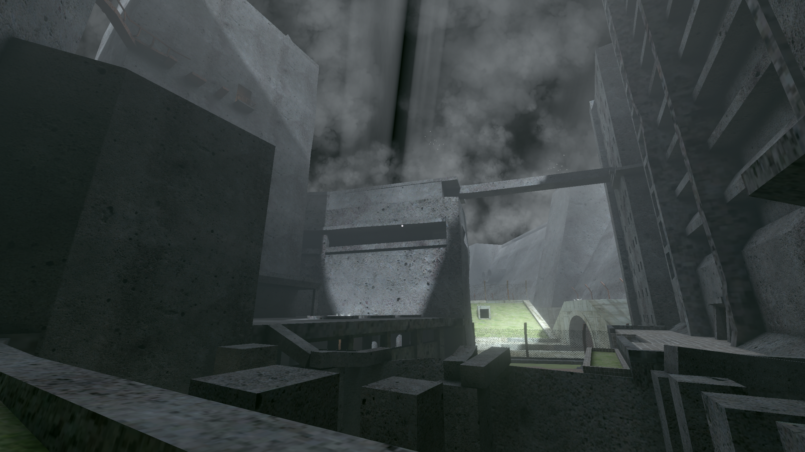
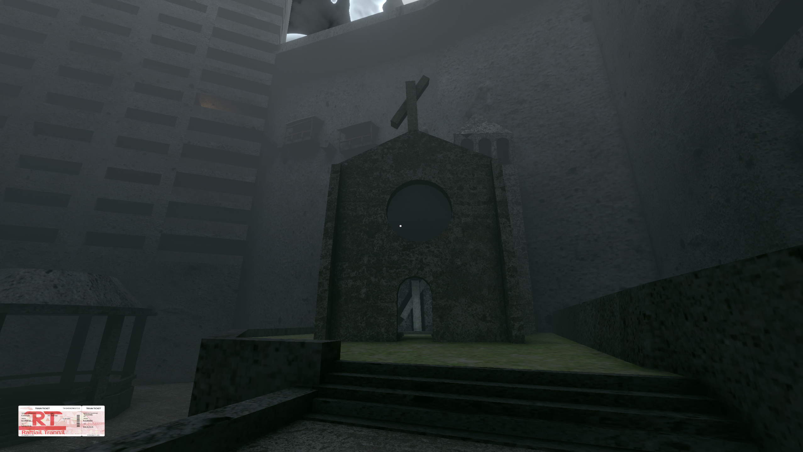

## Other "Dying Worlds"

BABBDI is far from the only game that offers this kind of experience. Over time, I’ve stumbled upon others, each with its own take on liminal beauty. Some I’ve played, and some are still waiting for the right moment to pull me in. Here’s a list of games I’m keeping in mind for my next exploration:

### [NaissanceE](https://store.steampowered.com/app/265690/NaissanceE/)

An obscure, magical first-person exploration game that feels like stepping into a giant, mysterious structure. It’s less about solving puzzles and more about letting yourself sink into its timeless, otherworldly atmosphere.

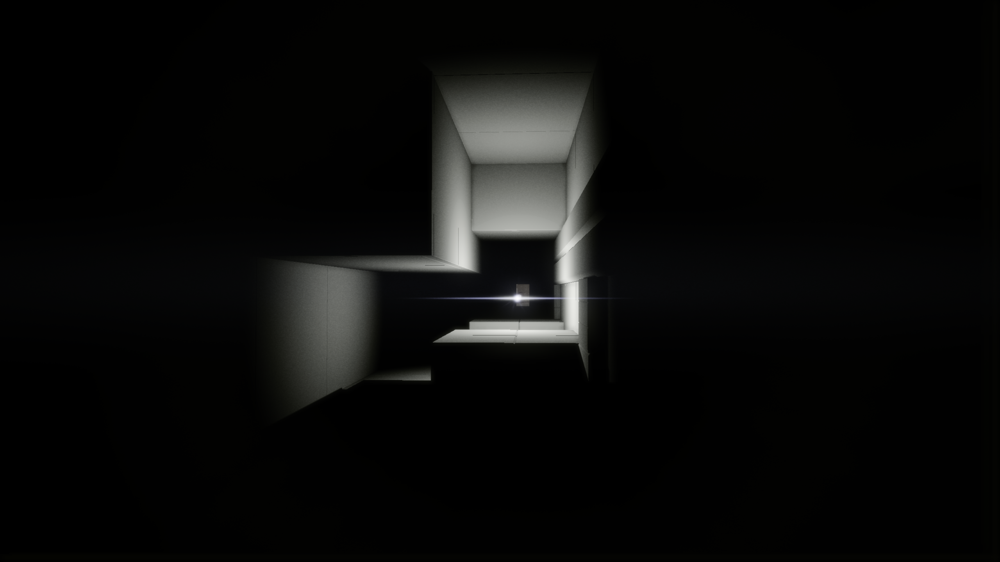 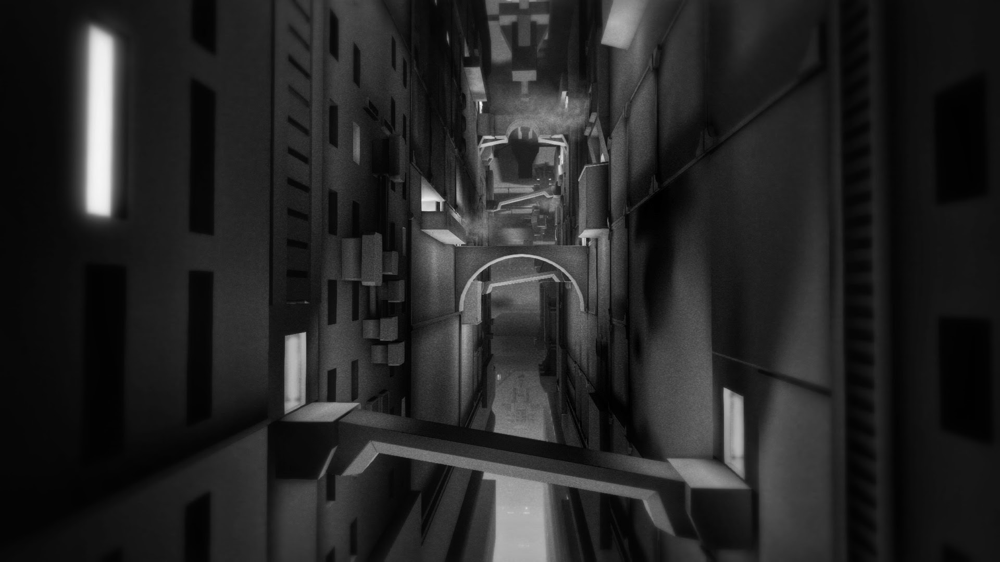

### [Concrete Paths](https://eugenio-lopez.itch.io/concrete-paths)
A meditative exploration through raw, brutalist architecture. This one feels like walking through forgotten spaces where the world fades to concrete and shadows.

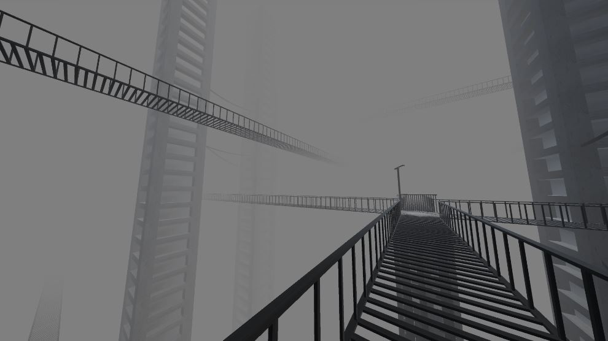

### [Concrete Tremor](https://mikeklubnika.itch.io/concrete-tremor)
A short, unsettling experience that captures the liminal tension of industrial environments. It’s minimalist but hits hard with its oppressive, empty mood.

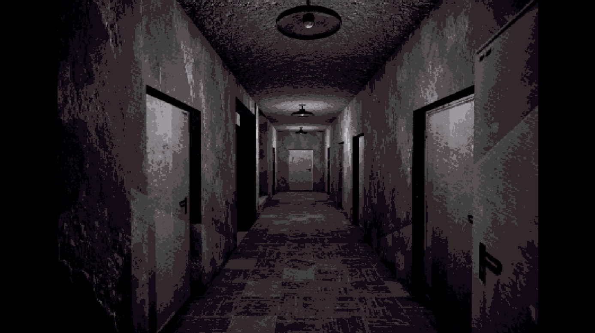

### [Fugue in Void](https://moshelinke.itch.io/fugue-in-void)
A game that feels more like a visual poem. It takes you through vast, hauntingly empty structures, forcing you to sit with the silence and soak in the mood.

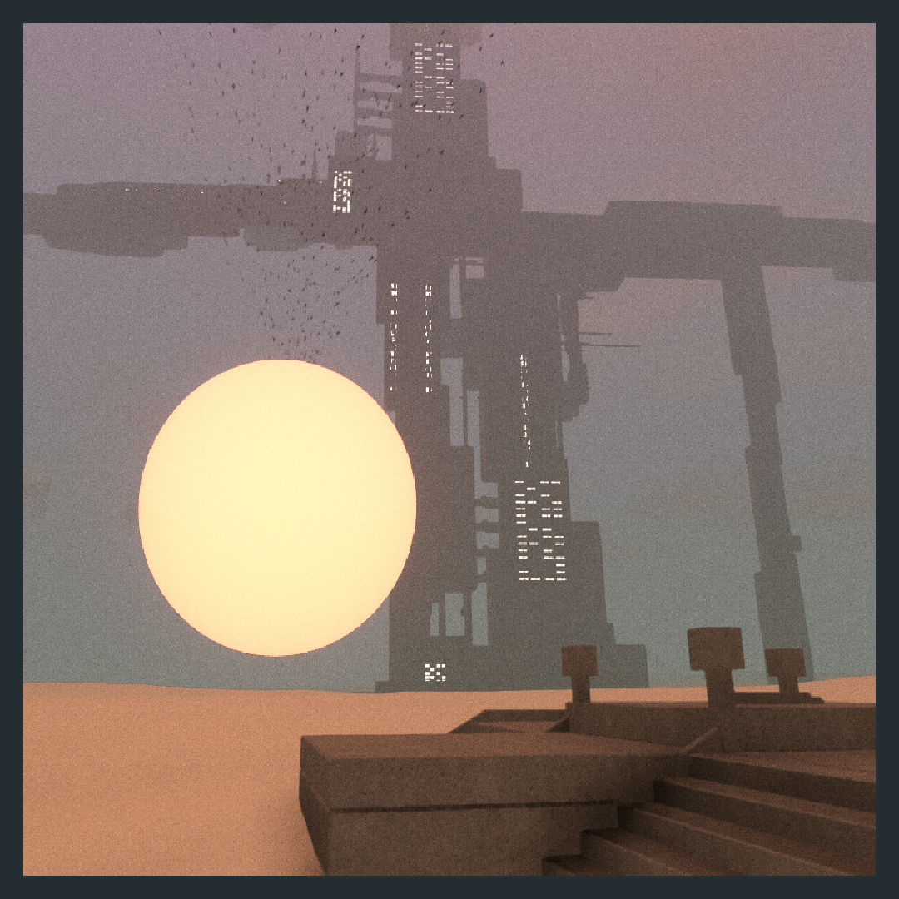

### [2:22AM](https://umbrella-isle.itch.io/222am)
A quiet, contemplative experience about wandering through a neon-lit urban landscape at night. It captures the strange mix of comfort and unease that comes with being awake when the rest of the world is asleep.

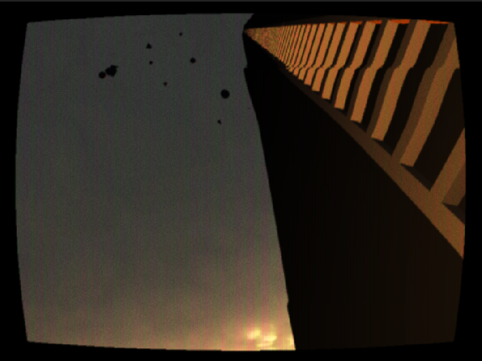

### [Kletka](https://store.steampowered.com/app/1699480/KLETKA/)

It might not perfectly match the “abandoned” theme, but its atmosphere and mood fit right into the same emotional space. Sometimes, it’s not about the specifics of the environment but the feeling it leaves behind—the echoes, the weight of something unspoken.

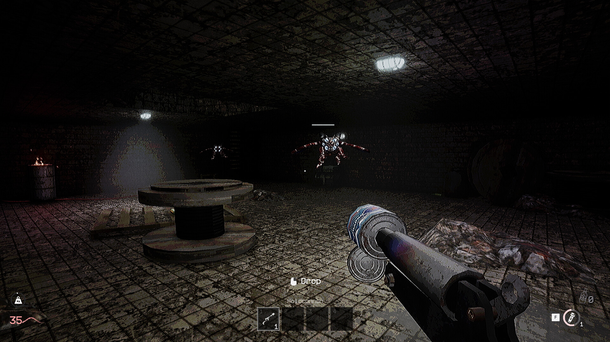

### [Machinarium](https://amanita-design.net/games/machinarium.html)
 Created by Amanita Design,this game isn’t about derelict spaces, yet it captures the same sense of isolation and melancholy. Set in a decaying mechanical world, it immerses you in empty, quiet environments where you feel more like a visitor than a participant. The beauty lies in its silence—the world doesn’t need to be abandoned to feel forgotten. With its delicate atmosphere and Tomas Dvorak’s haunting soundtrack, Machinarium evokes the feeling of wandering through spaces that time has left behind, allowing the stillness to speak for itself.

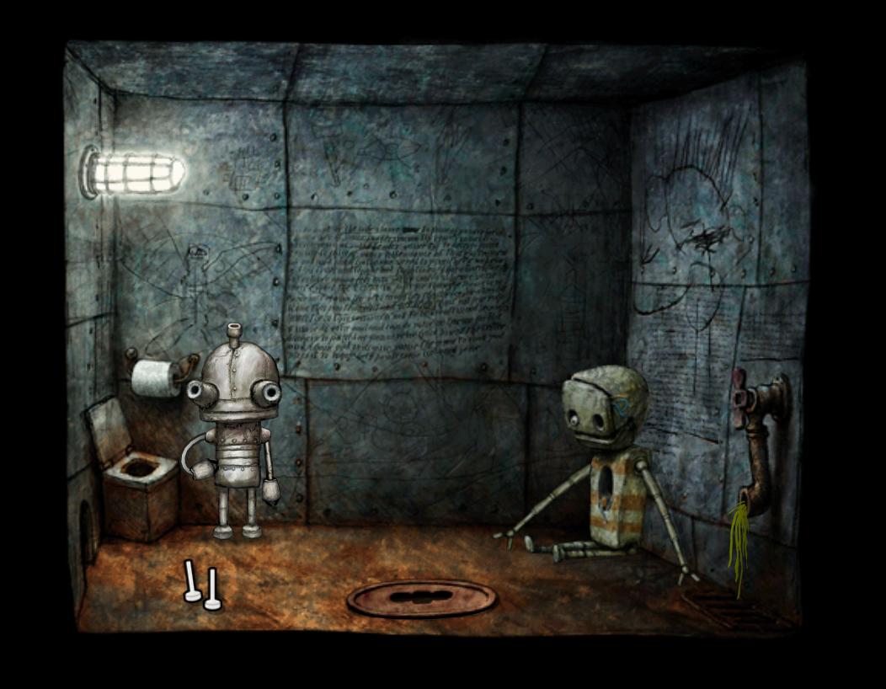

## Sweden - C148

As I get lost in these desolate worlds, there’s one track that always seems to match the feeling perfectly: “Sweden” by C418. Originally from Minecraft.

It’s strange and magical how music can emotionally transport you to the same places of abandoned nostalgia.



## Manga: Blame! by Tsutomu Nihei
[Blame!](https://w9.blame-manga.com/) is not a game, but it fits the vibe perfectly. A sprawling, nightmarish city that stretches endlessly, where silence and danger coexist. Nihei’s artwork is all sharp angles and impossible spaces—like a blueprint for the worlds these games explore.

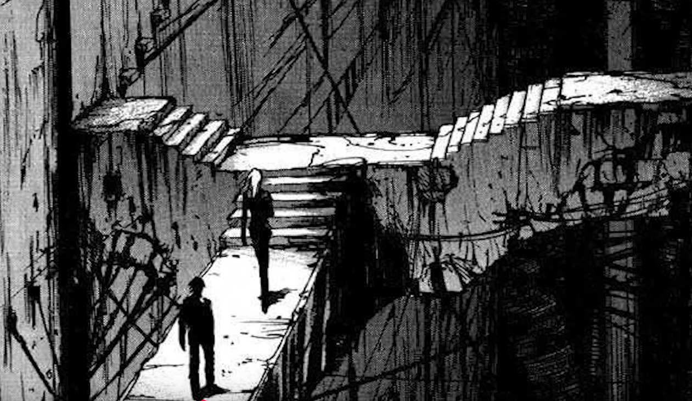

## Conclusion

These experiences remind me that games don’t always need grand narratives or complex mechanics to make an impact. Sometimes, the simplest thing—a quiet walk through an empty, crumbling world—is all it takes to feel profoundly connected to something beyond words.

So next time that strange, reflective mood strikes, I’ll know where to go. If anyone is reading this, you might find yourself in one of these worlds, too.

-------------------

