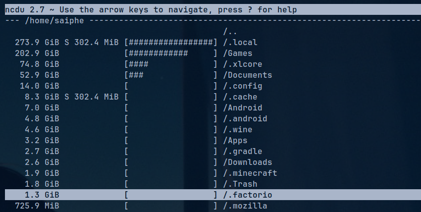
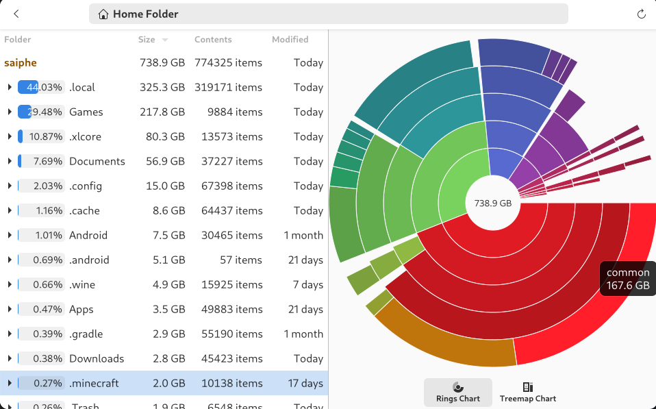

From time to time, you might need to free up disk space, but where do you start? How can you quickly locate those large files taking up valuable storage? Let’s explore some options. Spoiler alert: The first two are my top picks!

## Terminal

Command to Locate Large Files
```
find / -type f -size +2000M 2>/dev/null
```
`/`: Search from the root directory (change to specific directories like /home or /var for faster results).

`-type f`: Search for files only.

`-size +2000M`: Files larger than 2000 MB.

`2>/dev/null`: Suppress permission denied errors.


## Ncdu

Install ncdu:
```
sudo pacman -S ncdu
```
Run ncdu:
```
ncdu /
```
Use arrow keys to navigate



## GUI tool

If you prefer graphical tools, you can use baobab:

```
sudo pacman -S baobab
```


## Package cache

Check cache size:
```
du -sh /var/cache/pacman/pkg
```
Clean package cache:
```
sudo pacman -Sc
```
To remove all cached packages:
```
sudo pacman -Scc
```
## Log files

Check log sizes:
```
sudo du -sh /var/log/*
```
Clear logs ( use with caution !!! ):
```
sudo truncate -s 0 /var/log/filename.log
```
